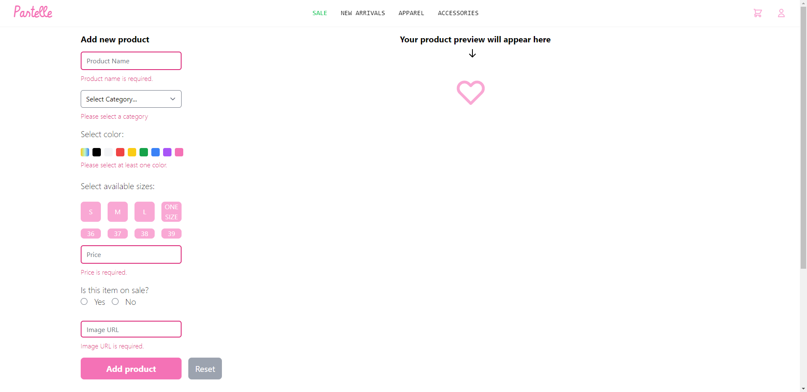

# Pastelle

Pastelle is an e-commerce app made with Java Spring and React JS. Users can browse items, and register in order to buy products. 

Front page (top)

Front page (bottom)

Products in the Apparel page, where you can filter them by type and color(soon to add sizes and price range).

Product page example (fetched by id from database) with carousel.

Product page on mobile

Admin page with field validation

Admin page after filling in details

## Technologies

- Java Spring
- ReactJS with Axios
- TailwindCSS
- PostgreSQL
